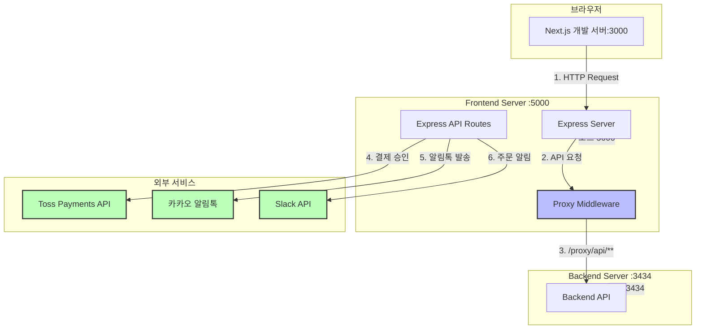
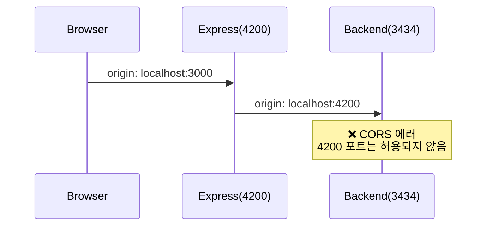
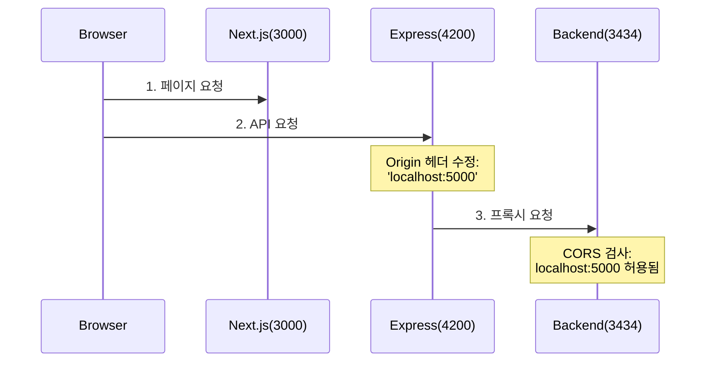

This is a [Next.js](https://nextjs.org/) project bootstrapped with [`create-next-app`](https://github.com/vercel/next.js/tree/canary/packages/create-next-app).

## Getting Started

First, run the development server:

```bash
npm run dev
# or
yarn dev
```

Open [http://localhost:3000](http://localhost:3000) with your browser to see the result.

You can start editing the page by modifying `pages/index.tsx`. The page auto-updates as you edit the file.

[API routes](https://nextjs.org/docs/api-routes/introduction) can be accessed on [http://localhost:3000/api/hello](http://localhost:3000/api/hello). This endpoint can be edited in `pages/api/hello.ts`.

The `pages/api` directory is mapped to `/api/*`. Files in this directory are treated as [API routes](https://nextjs.org/docs/api-routes/introduction) instead of React pages.


## To generate schema with get-graphql-schema(npm package) recommanded by relay.

if you don't have get-graphql-schema

```bash
npm install -g get-graphql-schema

yarn global add -g get-graphql-schema 

```

then, `get-graphql-schema [OPTIONS] ENDPOINT_URL > schema.graphql`
`get-graphql-schema http://localhost:3434/graphql > schema.graphql`


To run the development server:


```bash
yarn dev

```


## Learn More

To learn more about Next.js, take a look at the following resources:

- [Next.js Documentation](https://nextjs.org/docs) - learn about Next.js features and API.
- [Learn Next.js](https://nextjs.org/learn) - an interactive Next.js tutorial.

You can check out [the Next.js GitHub repository](https://github.com/vercel/next.js/) - your feedback and contributions are welcome!


## Deploy 

#### eb cli 를 이용한 aws elastic beanstalk 배포


## prepare-commit-msg

## AIFF Architecture Overview




AIFF 웹 애플리케이션은 다음과 같은 4개의 계층으로 구성되어 있습니다:

### 1. 클라이언트 계층
- Next.js 개발 서버 - React 기반 클라이언트 사이드 렌더링 
- 개발 환경에서의 HMR(Hot Module Replacement) 지원

### 2. 프론트엔드 서버 계층 (포트: 5000)
- Express 어플리케이션 서버로서 RESTful API 엔드포인트 제공 합니다.
- 결제, 알림 등 비즈니스 로직을 처리
- API Gateway/Proxy 역할
- 클라이언트와 백엔드 사이의 중개자 역할

### 3. 백엔드 서버 계층 (포트: 3434) - 현재 repository는 백엔드 서버 지원 X, 별도 repository에서 관리
- 핵심 비즈니스 로직 처리
- 데이터 관리 및 처리
- API 엔드포인트 제공

### 4. 외부 서비스 계층
- Toss Payments: 결제 처리
- 카카오 알림톡: 사용자 알림
- Slack: 내부 알림 및 모니터링

## API Flow
1. 클라이언트에서 API 요청 발생
2. Next.js 서버에서 요청 접수
3. Proxy Middleware가 백엔드로 요청 전달
4. 필요한 경우 외부 서비스와 통신
5. 응답을 클라이언트로 전달

## 프록시 설정
- 모든 API 요청은 `/proxy/api/**` 경로로 라우팅
- CORS 이슈 해결 및 보안 강화
- 백엔드 서버 주소 은닉



